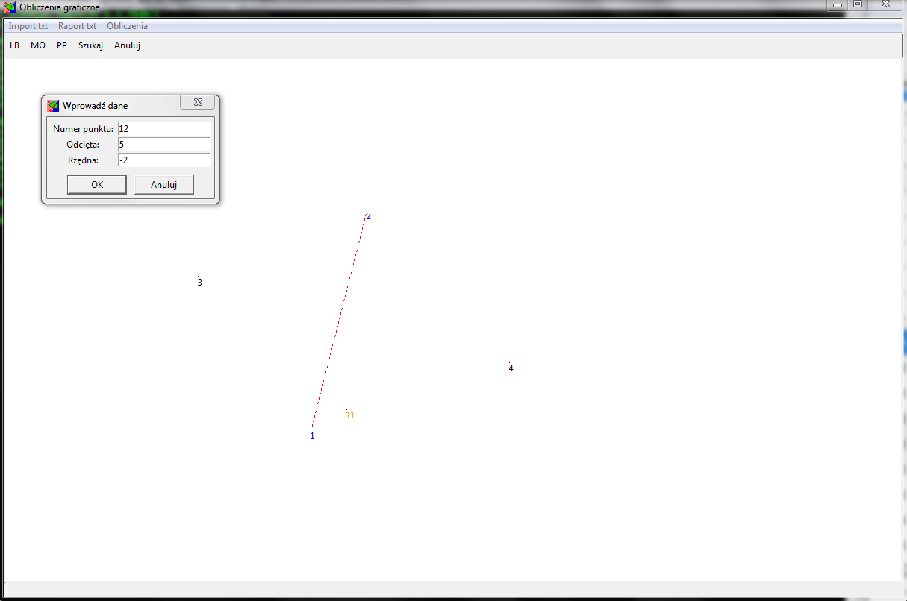

# gcalc

Program umożliwia wykonywanie podstawowych obliczeń geodezyjnych w sposób graficzny.

## Od czego zacząć

W wersji podstawowej program umożliwia dokonanie następujących obliczeń:

- miary ortogonalne
- przecięcie prostych

### Biblioteki

Program nie korzysta z żadnych zewntrznych bibliotek, interfejs graficzny prezentowany z wykorzystaniem tkinter.

### Pierwsze kroki

Aby rozpocząć porównywanie plików należy uruchomić program

```
python app.py
```



Powyżej główne okno programu 

## Uruchamianie testów

Testowanie z wykorzystaniem pytest, poniżej przykładowe polecenie generujące raport z testów wraz pokryciem kodu testami

```o
python -m pytest --cov-report term-missing --cov=gcalc .
```

## Wykorzystane biblioteki

* [tkinter](https://wiki.python.org/moin/TkInter) - python standard GUI


## Przyszłość

Poniżej lista rzeczy które powinny zostać dodane w najbliższym czasie

* anulowanie aktualnej operacji
* możliwość generowania raportów 
* dodatkowe moduły obliczeń (wcięcia)
* czasowe wyświetlanie komunikatów na pasku status


## Autor

* **Jakub Plata** - [geokodzilla](https://github.com/geokodzilla)

## Licencja

Projekt na licencji MIT License - szczegóły w pliku [LICENSE.md](LICENSE.md) 
